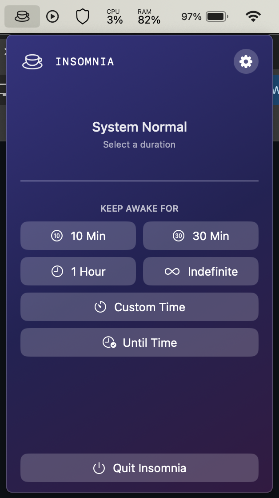
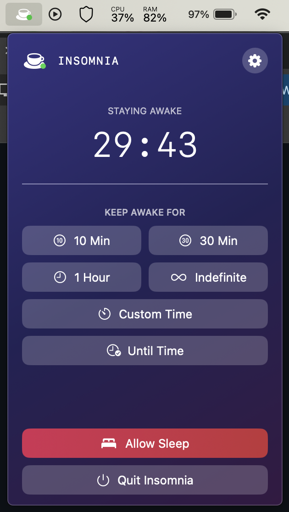
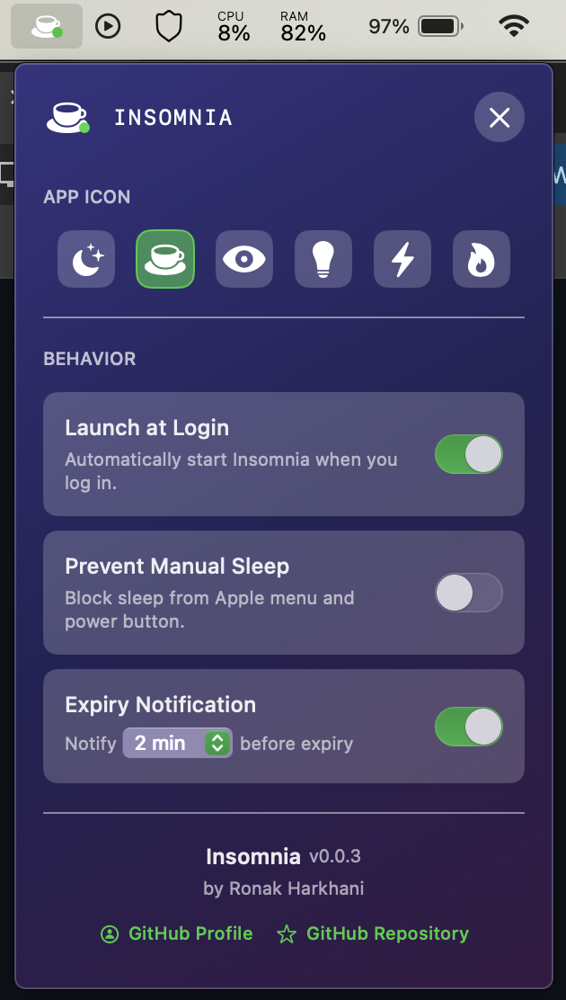

# Insomnia

A lightweight macOS menu bar app that prevents your Mac from sleeping.

<table align="center">
  <tr>
    <td></td>
    <td></td>
    <td></td>
  </tr>
</table>

## Features

- **Keep Your Mac Awake** — Prevent sleep for 10 min, 30 min, 1 hour, indefinitely, or set a custom duration
- **Menu Bar App** — Lives in your menu bar, always one click away
- **Customizable Icons** — Choose from 6 different icon styles
- **Smart Notifications** — Get notified before the timer expires
- **Prevent Manual Sleep** — Optionally block sleep from Apple menu and power button
- **Launch at Login** — Start automatically when you log in

## Installation

### Download

Download the latest release from the [Releases](../../releases) page.

### Install

1. Open the downloaded DMG file
2. Drag **Insomnia** to your Applications folder
3. Launch Insomnia from Applications

### First Launch

Since the app isn't notarized, macOS will block it on first launch. To open it:

1. **Right-click** (or Control-click) on Insomnia in Applications
2. Click **Open** from the context menu
3. Click **Open** in the dialog that appears

Alternatively: **System Settings → Privacy & Security → scroll down → click "Open Anyway"**

You only need to do this once.

## Usage

1. Click the Insomnia icon in your menu bar
2. Select a duration (10 min, 30 min, 1 hour, indefinite, or custom)
3. Click **Start** — your Mac will stay awake until the timer ends
4. Click **Stop** anytime to allow sleep again

### Verify It's Working

Run this in Terminal to confirm sleep prevention is active:

```bash
pmset -g assertions
```

Look for: `Insomnia is keeping the system awake`

## Requirements

- macOS 15.4 or later

## Building from Source

1. Clone the repository
2. Open `Insomnia.xcodeproj` in Xcode 16.3+
3. Build and run (⌘R)

## License

MIT License - see [LICENSE](LICENSE) for details.